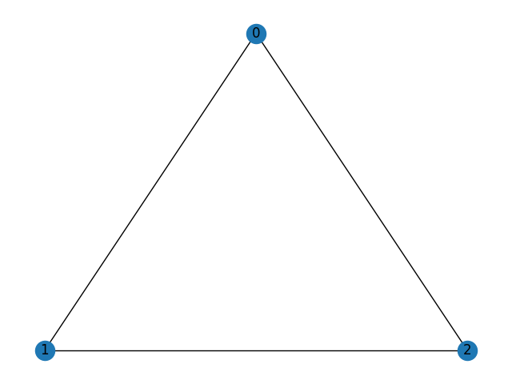

# Introduction
This project is aimed to draw a triangulation on a plane.\
The current tools, such as networkx, perform not well,
so this is why this project emerges.\
A triangulation is a planar graph, each face of which is a triangle, or equivalently it satisfies $m=3n-6$ where $m$/$n$ is the number of edges/vertices of the graph.\
For the purpose of studying the four color theorem, we mainly consider triangulations that are 5-star-connected, which means they are 5-connected and any 5-ring must be a 5-wheel.
# Input
Currently users guarantee the input is a 5-star-connected triangulation,
which will be verified by the program in the future.\
The input json file is in the following format:
```json
{
  "0": ["1", "2"],
  "1": ["0", "2"],
  "2": ["0", "1"]
}
```
The keys are vertices of the graph, while the values are their neighbors.
# Output
The output json file is in the following format:
```json
{
  "0": [0, 1],
  "1": [-0.866, -0.5],
  "2": [0.866, -0.5]
}
```
The keys are vertices of the graph,
while the values are their coordinates on the plane.\
This file can be visualized by using script/visualize.py:
```bash
python visualize.py triangle demo # create data/output/demo_triangle.png from data/input/triangle.json and data/output/demo_triangle.json
python visualize.py triangle      # create data/output/triangle.png from data/input/triangle.json and data/output/triangle.json
```
The difference between data/output/demo_triangle.json and data/output/triangle.json is that\
demo_triangle.json shall be offered by users,\
triangle.json shall be generated by our project.\
The corresponding png file is as follows:


